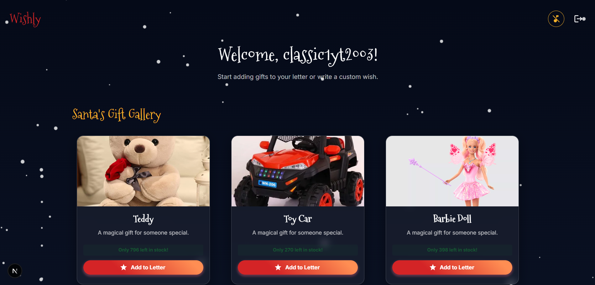
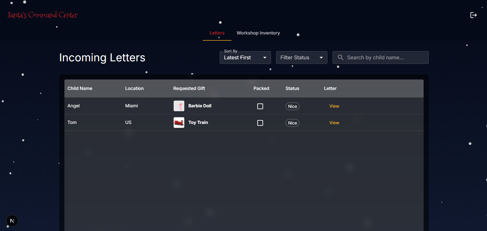
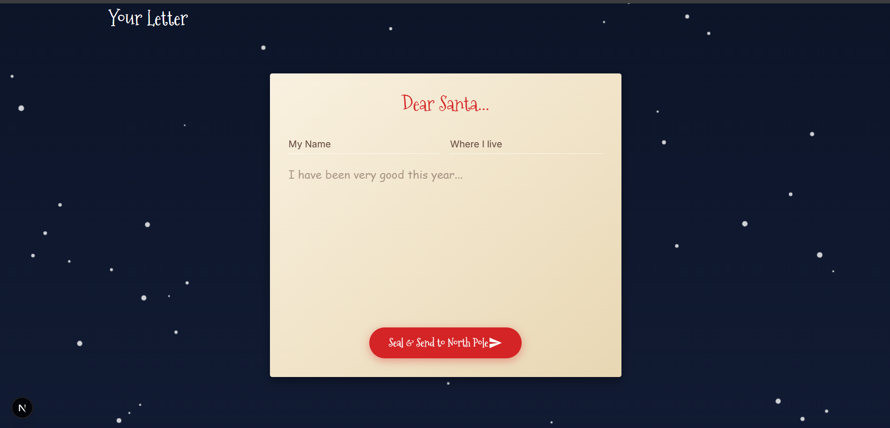
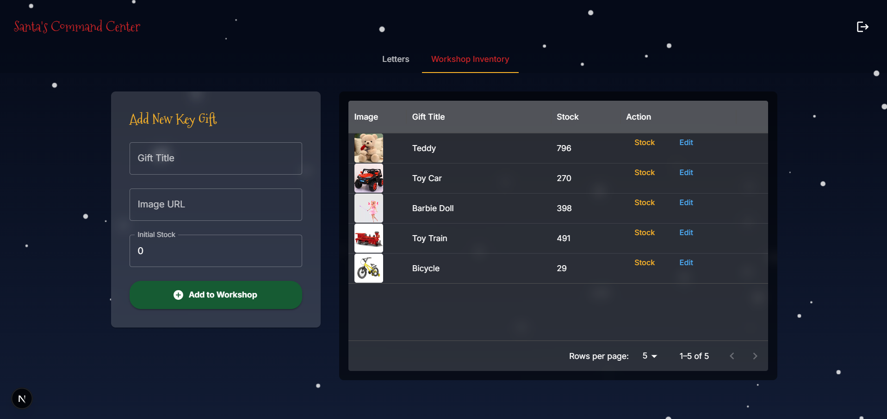

# 🎄 Wishly — Santa’s Digital Letter Platform

Wishly is a full-stack Christmas-themed web application where kids can write letters to Santa, choose gifts, and get their wishes magically delivered to the North Pole.  
Santa has his own dashboard to manage letters, inventory, and automatically sort children into **Nice** or **Naughty** lists using AI.

This project demonstrates a real-world full-stack architecture with modern technologies, secure authentication, AI integration, and a rich interactive UI.

---

## ✨ Features

### 🧒 User Features
- Write letters to Santa
- Choose gifts from Santa’s workshop
- Real-time gift stock updates
- Animated letter sending experience
- Beautiful Christmas-themed UI
- AI-based Naughty / Nice classification

### 🎅 Santa Features
- Secure Santa login
- View and manage all incoming letters
- Filter and sort letters (status, popularity, latest, etc.)
- AI-powered letter analysis
- Mark gifts as packed
- Manage workshop inventory
- Real-time dashboard updates

### 🤖 AI System
- Automatically analyzes letter content
- Classifies children as **Nice** or **Naughty**
- Powered by **Google Gemini AI**

---

## 🧰 Tech Stack

### Frontend
- **Next.js (App Router)**
- **React**
- **TypeScript**
- **Material UI**
- **Framer Motion**
- **Axios**

### Backend
- **Node.js**
- **Express**
- **MongoDB**
- **Mongoose**
- **JWT Authentication**
- **Repository Pattern**
- **SOLID Principles**

### AI Integration
- **Google Gemini AI**

---

## 🖼️ Screenshots

### 🧒 User Dashboard


### 🎅 Santa Dashboard


### ✉️ Letter Writing


### 🎁 Gift Gallery


---

## ⚙️ Setup Instructions

### 1️⃣ Clone the repository

```bash
git clone https://github.com/Sudheesh-ks/Wishly.git
cd wishly
```

### 2️⃣ Setup Backend

```bash
cd backend
npm install


Create a .env file inside the backend folder:

PORT=5000
MONGO_URI=your_mongodb_connection_string
JWT_SECRET=your_secret_key
GEMINI_API_KEY=your_gemini_api_key


Start the backend server:

npm run dev
```

### 2️⃣ Setup Frontend

```bash
cd frontend
npm install


Create a .env file inside the frontend folder:

NEXT_PUBLIC_BACKEND_URL=http://localhost:5000


Run the frontend server:

npm run dev
```

### 2️⃣ Open In Browser

```bash
http://localhost:3000
```
